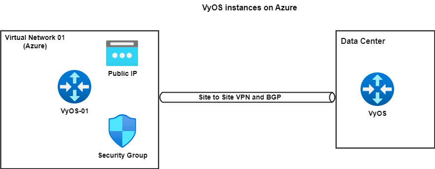

# VyOS instance (NVA) on Azure (with Site to Site VPN, Static/Dynamic (BGP), NAT, DNS forwarding and Firewall options)

This Terraform module deploys a VyOS instance (NVA) on Azure. All necessary parameters will be configured automatically, and you will receive management and access information from outputs.
This is the connection diagram:


The module consists of different files containing necessary resources and variables:

- `provider.tf`: Each resource in the configuration must be associated with one provider configuration. Provider configurations, unlike most other concepts in Terraform, are global to an entire Terraform configuration and can be shared across module boundaries.

- `variables.tf`: Access information, network parameters, VyOS image parameters, and virtual network parameters are defined here. You may edit/change these parameters based on your requirements. **Note:** After editing IP addresses inside `variables.tf`, check `files/vyos_01_user_data.tpl` file as well. All necessary configurations are based on this file.

- `security_groups.tf`: Security groups are one of the most important pillars that support vNET security. They are software-defined network firewalls defined inside a vNet that allow or deny traffic to resources based on the inbound and outbound rules. They support stateful Layer 3 (Network layer) and Layer 4 (Transport layer) filtering capabilities.

- `virtual_networks.tf`: All network resources such as Virtual Network, Subnets, Network Interface Cards, Public IP Address, Routing Table contains in this file.

- `main.tf`: Contains the resource definitions for the VyOS VM (NVA).

- `files/vyos_01_user_data.tpl` : All necessary configurations of the VyOS instance have been defined in this file based on the VyOS CLI reference.

- `files/on_prem_vyos_instance.conf`: Contains the configuration for the on-premise VyOS instance, which can serve as a reference when setting up a site-to-site VPN with the Azure VyOS instance.

- `outputs.tf`: Will contain the output definitions for the module, such as access data, Public IP Address of the VyOS instances, etc.

## Prerequisites

Before applying this module, ensure you have:

- An active Azure subscription:
    ```sh
    az account set --subscription "<subscription ID or name>"
    ```

- Azure CLI installed. [Installation link](https://learn.microsoft.com/en-us/cli/azure/install-azure-cli)

- Logged in with Azure credentials via CLI:
    ```sh
    az version
    az login
    ```

- Azure Resource Group (RG) created:
    ```sh
    az group create --name demoResourceGroup --location westus
    az group list
    az group show --name exampleGroup
    ```

- Terraform installed. [Installation link](https://developer.hashicorp.com/terraform/tutorials/aws-get-started/install-cli)


## Usage

### Setup Variables

All variables needed for customization are defined in `variables.tf`. Adjust them according to your infrastructure requirements.

### Implementation Process

1. Run `terraform fmt` to format the structure.
2. Execute `terraform validate` to perform a syntax check.
3. Use `terraform plan` to preview the infrastructure changes before applying.
4. Run `terraform apply` to apply the script and provision the infrastructure.
5. Use `terraform output` to view the management IP and credentials for the VyOS instance.
6. To destroy the infrastructure, execute `terraform destroy`.

### Management

For management, use the `VyOS_01_Public_IP_Address` and VyOS credentials from `outputs`.

Sample command: `ssh vyos@<VyOS_01_Public_IP_Address>`

### Note

Ensure that you have appropriate permissions and configurations set up in your Azure environment before executing the Terraform commands.

Feel free to modify the script to suit your specific testing needs.

For further assistance or customization, refer to the VyOS, Terraform, and Azure documentation.
