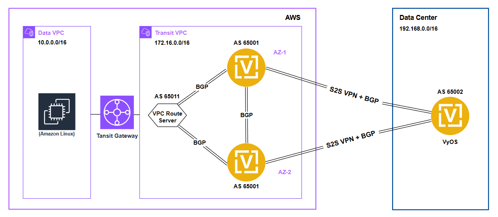

# Terraform Project for deploying VyOS HA on AWS with VPC Route Server and Transit Gateway

This Terraform project automates the deployment of **two VyOS instances** in High Availability (HA) mode on AWS, integrated with a **VPC Route Server** and **Transit Gateway** for advanced network connectivity, routing and High Availability (HA) use cases.

In addition to the VyOS HA setup, this project also deploys two VPCs: a **Transit VPC** and a **Data VPC**.  
- The **Transit VPC** is used for deploying VyOS instances and the VPC Route Server.  
- The **Data VPC** simulates a VPC attachment and includes a test **Amazon Linux EC2 instance** to validate data path connectivity.

> If you already have an existing AWS infrastructure, you can **exclude** the Data VPC, its subnets, and the EC2 instance. To do so, update the following Terraform files accordingly: `main.tf`, `network.tf`, `transit_gateway.tf`, `variables.tf`, and `outputs.tf`.

This is the connection diagram:


## Why This Topology?

This solution is designed for organizations that require **highly available** routing with dynamic connectivity to multiple AWS VPCs or hybrid environments.

### Key Benefits of the HA Topology:

- **Effective Failover with BGP Redundancy**  
  Two VyOS EC2 instances are deployed as BGP peers, each connected to the AWS VPC Route Server. While technically both routers are active BGP participants, only one is typically preferred as the next-hop.

  If one VyOS instance fails or is taken offline for maintenance, **Bidirectional Forwarding Detection (BFD)** detects the failure in milliseconds. The route server:
  - Withdraws routes for the failed peer from the RIB.
  - Recalculates the best path using the FIB.
  - Updates affected VPC route tables with the new next-hop (preferred VyOS instance).
  
  This process enables **sub-second failover** (typically <1s), far faster than AWS native route table failover mechanisms using the API.

  This approach is particularly valuable for use cases requiring **business continuity**, **low RTO**, and **fast edge recovery** during:
  - Instance crashes
  - VyOS OS upgrades or maintenance procedures
  - Network disruptions

This architecture is ideal for:
- Cloud edge routing with failover
- Multi-VPC and multi-region route control
- Enterprises requiring resilient and scalable cloud network infrastructure

## Prerequisites

Before applying this module, ensure you have:

### AWS Requirements

- An active AWS account.
- AWS CLI installed. [Installation link](https://docs.aws.amazon.com/cli/latest/userguide/getting-started-install.html)
- Terraform installed. [Installation link](https://developer.hashicorp.com/terraform/tutorials/aws-get-started/install-cli)

### Set AWS environment variables

- Run the following commands in your terminal to set the AWS environment variables:

```sh
export AWS_ACCESS_KEY_ID="<AWS_ACCESS_KEY_ID>"
export AWS_SECRET_ACCESS_KEY="<AWS_SECRET_ACCESS_KEY>"
export AWS_SESSION_TOKEN="<AWS_SESSION_TOKEN>"
export AWS_DEFAULT_REGION="<AWS_REGION>" # e.g us-east-1
```

### Fetch AMI ID and Owner ID (Required for main.tf)
1. Subscribe to VyOS in the AWS Marketplace.
2. Use the following AWS CLI command to find the correct AMI ID, Owner ID, and ensure you're querying the correct region (e.g., `us-east-1`):

```sh
aws ec2 describe-images \
  --owners aws-marketplace \
  --filters "Name=product-code,Values=8wqdkv3u2b9sa0y73xob2yl90" \
  --query 'Images[*].[ImageId,OwnerId,Name]' \
  --output table
```
Alternatively, you can hardcode the latest AMI ID for your region in `variables.tf` adding the `vyos_ami_id` variable.

### Generate SSH keypair

A demo key is included in the `keys/` folder. To generate your own:

```sh
ssh-keygen -b 2048 -t rsa -m PEM -f keys/vyos_custom_key.pem
```

## Project Structure

```
.
├── files/
│   ├── on-prem-vyos-config.txt
│   ├── vyos_01_user_data.tfpl
│   └── vyos_02_user_data.tfpl
├── keys/
│   ├── vyos_lab_private_key.pem
│   └── vyos_lab_public_key.pem
├── main.tf
├── network.tf
├── security_groups.tf
├── transit_gateway.tf
├── output.tf
├── provider.tf
├── variables.tf
└── README.md
```

## Usage

### Setup Variables

All variables are defined in `variables.tf`. Customize values like instance type, region, `vyos_ami_id`, etc.

## How to Run the Module

Follow these steps to initialize, plan, apply, and manage your infrastructure with Terraform:

1. **Initialize the Module**
   ```sh
   terraform init
   ```

2. **Format the Terraform Code**
   ```sh
   terraform fmt
   ```

3. **Validate Configuration**
   ```sh
   terraform validate
   ```

4. **Preview Infrastructure Changes Before Deployment**
   ```sh
   terraform plan
   ```

5. **Apply the Configuration**
   ```sh
   terraform apply
   ```
   Confirm the execution when prompted to provision the infrastructure.

6. **View Outputs**
   ```sh
   terraform output
   ```
   This will display the management IP and test results for the VyOS instance.

## Management

To manage the VyOS instance, use the `vyos_public_ip` from `terraform output`:
```sh
ssh vyos@<vyos_public_ip> -i keys/vyos_lab_private_key.pem
```
The on-premises VyOS configuration can be found in `files/on-prem-vyos-config.txt`.

## Post-Deployment Operations

**VPC Route Server** is not managed by Terraform and must be deployed manually.

### References

- [How it Works](https://docs.aws.amazon.com/vpc/latest/userguide/route-server-how-it-works.html)
- [Dynamic Routing Guide](https://docs.aws.amazon.com/vpc/latest/userguide/dynamic-routing-route-server.html)
- [Tutorial](https://docs.aws.amazon.com/vpc/latest/userguide/route-server-tutorial.html)

## Manual Steps

### Step 1: Required IAM Permissions

```json
{
  "Version": "2012-10-17",
  "Statement": [
    {"Sid": "CreateRouteServer","Effect": "Allow","Action": ["sns:CreateTopic"],"Resource": "*"},
    {"Sid": "DeleteRouteServer","Effect": "Allow","Action": ["sns:DeleteTopic"],"Resource": "*"},
    {"Sid": "CreateRouteServerEndpoint","Effect": "Allow","Action": [
      "ec2:CreateNetworkInterface","ec2:CreateNetworkInterfacePermission","ec2:CreateSecurityGroup",
      "ec2:DescribeSecurityGroups","ec2:AuthorizeSecurityGroupIngress","ec2:CreateTags","ec2:DeleteTags"
    ],"Resource": "*"},
    {"Sid": "DeleteRouteServerEndpoint","Effect": "Allow","Action": [
      "ec2:DeleteNetworkInterface","ec2:DeleteSecurityGroup","ec2:RevokeSecurityGroupIngress",
      "ec2:CreateTags","ec2:DeleteTags"
    ],"Resource": "*"},
    {"Sid": "CreateRouteServerPeer","Effect": "Allow","Action": ["ec2:AuthorizeSecurityGroupIngress"],"Resource": "*"},
    {"Sid": "DeleteRouteServerPeer","Effect": "Allow","Action": ["ec2:RevokeSecurityGroupIngress"],"Resource": "*"}
  ]
}
```

### Step 2–7: Route Server Setup (Summarized)

#### Step 2: Create Route Server
- Go to AWS Console > VPC > Route Servers > Create
- Set name, ASN (e.g., `65011`), no persist routes

#### Step 3: Associate with VPC

#### Step 4: Create Route Server Endpoints
- Create 2 endpoints (1 per VyOS)

#### Step 5: Enable Route Propagation
- From the Route Server UI → Propagations → Enable

#### Step 6: Create Route Server Peers
- Create peer for each VyOS using endpoint IP, ASN (65001), BFD

### Step 7: Configure VyOS BGP Sessions

#### VyOS-01

```vyos
delete protocols bfd peer 172.16.11.115
set protocols bfd peer <VPC ROUTE SRV ENDPOINT-01 IP> interval multiplier '3'
set protocols bfd peer <VPC ROUTE SRV ENDPOINT-01 IP> interval receive '300'
set protocols bfd peer <VPC ROUTE SRV ENDPOINT-01 IP> interval transmit '300'

delete protocols bgp neighbor 172.16.11.115
set protocols bgp neighbor <VPC ROUTE SRV ENDPOINT-01 IP> address-family ipv4-unicast route-map export 'AS65011-OUT'
set protocols bgp neighbor <VPC ROUTE SRV ENDPOINT-01 IP> address-family ipv4-unicast soft-reconfiguration inbound
set protocols bgp neighbor <VPC ROUTE SRV ENDPOINT-01 IP> bfd
set protocols bgp neighbor <VPC ROUTE SRV ENDPOINT-01 IP> disable-connected-check
set protocols bgp neighbor <VPC ROUTE SRV ENDPOINT-01 IP> remote-as '65011'
set protocols bgp neighbor <VPC ROUTE SRV ENDPOINT-01 IP> timers holdtime '30'
```

#### VyOS-02

```vyos
delete protocols bfd peer 172.16.21.177
set protocols bfd peer <VPC ROUTE SRV ENDPOINT-02 IP> interval multiplier '3'
set protocols bfd peer <VPC ROUTE SRV ENDPOINT-02 IP> interval receive '300'
set protocols bfd peer <VPC ROUTE SRV ENDPOINT-02 IP> interval transmit '300'

delete protocols bgp neighbor 172.16.21.177
set protocols bgp neighbor <VPC ROUTE SRV ENDPOINT-02 IP> address-family ipv4-unicast route-map export 'AS65011-OUT'
set protocols bgp neighbor <VPC ROUTE SRV ENDPOINT-02 IP> address-family ipv4-unicast soft-reconfiguration inbound
set protocols bgp neighbor <VPC ROUTE SRV ENDPOINT-02 IP> bfd
set protocols bgp neighbor <VPC ROUTE SRV ENDPOINT-02 IP> disable-connected-check
set protocols bgp neighbor <VPC ROUTE SRV ENDPOINT-02 IP> remote-as '65011'
set protocols bgp neighbor <VPC ROUTE SRV ENDPOINT-02 IP> timers holdtime '30'
```

## Destroying Resources

To clean up the deployed infrastructure:
```sh
terraform destroy
```
Confirm when prompted.
