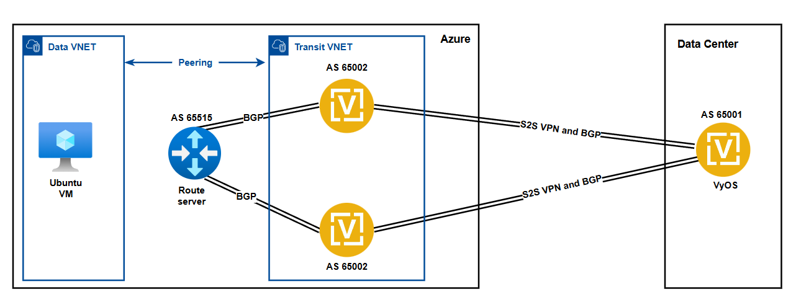

# Terraform Project for Deploying VyOS on Azure with Route Server and High Availability Topology

This Terraform project automates the deployment of **VyOS virtual routers** in Microsoft Azure, configured for **High Availability (HA)** and **dynamic routing** using Azure Route Server. It simulates a hybrid or multi-cloud environment and is ideal for validating routing, redundancy, and failover scenarios.

The architecture includes:
- Two VyOS routers in a Transit VNET, configured with BGP
- Azure Route Server for dynamic route distribution
- Site-to-Site VPN connections to a simulated on-premises VyOS router
- An Ubuntu VM for connectivity and routing validation
- A Data VNET for testing and diagnostics

---

## Key Features

- **High Availability**: Dual VyOS routers for redundancy and failover
- **Dynamic Routing**: BGP-based routing via Azure Route Server
- **Hybrid Connectivity**: Site-to-Site VPN integration with a simulated on-prem VyOS
- **Testing Environment**: Includes Ubuntu VM for verification and diagnostics
- **Modular & Flexible**: Easily configurable via variables

---

## Why Use This Module?

This module provides a robust, repeatable foundation for building **resilient network architectures** in Azure. By combining VyOS's powerful routing features with Terraform and Azure-native services, it enables:

- Rapid deployment of cloud edge routers
- Full control over BGP route advertisement and filtering
- Realistic HA and disaster recovery simulations
- Seamless integration with hybrid or multi-cloud infrastructure

> Ideal for testing **HA failover** and **cloud edge connectivity** in Azure.
      
---

## Topology Overview

This is the connection diagram:  


This deployment architecture simulates a real-world enterprise network scenario for testing and validation purposes.

### Description

#### Transit VNET:
- Hosts two VyOS virtual routers (same AS 65002)
- BGP peering with Azure Route Server
- Site-to-Site VPN tunnels to a simulated on-premises Data Center VyOS (AS 65001)

#### Data VNET:
- Peered with Transit VNET
- Ubuntu VM for testing

#### Azure Route Server (AS 65515):
- BGP sessions with both VyOS routers
- Distributes learned routes across peered VNets dynamically

#### On-Premises VyOS (AS 65001):
- BGP and S2S VPN connections with both Azure VyOS routers
- Enables redundancy and real failover scenarios

---

## Prerequisites

Before applying this module, ensure you have:

- An active Azure subscription:
    ```sh
    az account set --subscription "<subscription ID or name>"
    ```

- Azure CLI installed.  
  [Installation link](https://learn.microsoft.com/en-us/cli/azure/install-azure-cli)

- Logged in with Azure credentials via CLI:
    ```sh
    az version
    az login
    ```

- Azure Resource Group (RG) created:
    ```sh
    az group create --name demoResourceGroup --location westus
    az group list
    az group show --name exampleGroup
    ```

- Terraform installed.  
  [Installation link](https://developer.hashicorp.com/terraform/tutorials/aws-get-started/install-cli)

- Generate SSH key:
    ```sh
    ssh-keygen -t rsa -b 4096 -f keys/id_rsa
    ```

---

## Project Structure

```
.
├── files/
│   ├── on-prem-vyos-config.txt
│   ├── vyos_01_user_data.tfpl
│   └── vyos_02_user_data.tfpl
├── keys/
│   └── ssh keys
├── diagram/
│   └── VyOS-HA-setup-on-Azure.png
├── main.tf
├── network.tf
├── route_server.tf
├── security_groups.tf
├── variables.tf
├── outputs.tf
├── provider.tf
└── readme.md
```

---

## Usage

### Setup Variables

All variables needed for customization are defined in `variables.tf`. Adjust them according to your infrastructure requirements.

---

## How to Run the Module

Follow these steps to initialize, plan, apply, and manage your infrastructure with Terraform:

1. **Initialize the Module**
    ```sh
    terraform init
    ```
    This command initializes the Terraform working directory, downloads provider plugins, and prepares the environment.

2. **Format Code**
    ```sh
    terraform fmt
    ```
    This command formats the Terraform code to a canonical format and style.

3. **Validate Configuration**
    ```sh
    terraform validate
    ```
    This command checks the configuration for syntax errors and validates the configuration files.

4. **Preview Infrastructure Changes**
    ```sh
    terraform plan
    ```
    This command creates an execution plan, showing what actions Terraform will take to change the infrastructure.

5. **Apply the Configuration**
    ```sh
    terraform apply
    ```
    Confirm when prompted to create the resources defined in the configuration files.
    This command applies the changes required to reach the desired state of the configuration.
    It will create the VyOS routers, Route Server, and associated resources in Azure.
    > **Note:** Ensure you have the correct permissions in your Azure subscription to create resources.

6. **View Outputs**
    ```sh
    terraform output
    ```
    This command displays the outputs defined in `outputs.tf`, such as public IPs of the VyOS routers and Route Server.
    Use these IPs to access the VyOS routers and verify connectivity.

7. **Destroy Infrastructure**
    ```sh
    terraform destroy
    ```
    This command destroys all resources created by the Terraform configuration. Confirm when prompted.
    Use this command to clean up resources after testing or when they are no longer needed.

---

### Management

To access the VyOS VM: 

```sh
ssh adminuser@<vyos_public_ip>
```
Replace `<vyos_public_ip>` with the public IP address of the VyOS router you want to access.

To access the Ubuntu VM:

```sh
ssh adminuser@<ubuntu_public_ip>
```
Replace `<ubuntu_public_ip>` with the public IP address of the Ubuntu VM you want to access.

---

## Post-Deployment Configuration

After deployment, apply the following manual changes to both VyOS routers.
    
### VyOS-01

```vyos
set protocols static route 192.168.3.0/27 next-hop 192.168.11.1
set protocols static route 192.168.41.0/24 next-hop 192.168.11.1

delete vpn ipsec site-to-site peer On-Prem-VyOS remote-address
set vpn ipsec site-to-site peer On-Prem-VyOS remote-address '<On-Prem-VyOS-Pub-IP>'
set vpn ipsec options disable-route-autoinstall
```

### VyOS-02

```vyos
set protocols static route 192.168.3.0/27 next-hop 192.168.21.1
set protocols static route 192.168.41.0/24 next-hop 192.168.21.1

delete vpn ipsec site-to-site peer On-Prem-VyOS remote-address
set vpn ipsec site-to-site peer On-Prem-VyOS remote-address '<On-Prem-VyOS-Pub-IP>'
set vpn ipsec options disable-route-autoinstall
```

> **Replace the placeholders as needed:**
>
> - `192.168.3.0/27`: Route Server subnet (adjust if different)  
> - `192.168.41.0/24`: Data VNET subnet (adjust if different)  
> - `192.168.11.1`: VyOS-01 private subnet gateway  
> - `192.168.21.1`: VyOS-02 private subnet gateway  
> - `<On-Prem-VyOS-Pub-IP>`: Public IP of your on-prem VyOS

## Additional Resources

- [VyOS Documentation](https://docs.vyos.io/en/1.4/)
- [Azure Route Server Documentation](https://learn.microsoft.com/en-us/azure/route-server)
- [Terraform Azure Provider Documentation](https://registry.terraform.io/providers/hashicorp/azurerm/latest/docs)
- [Terraform Documentation](https://www.terraform.io/docs/index.html)
- [Azure CLI Documentation](https://learn.microsoft.com/en-us/cli/azure/)
