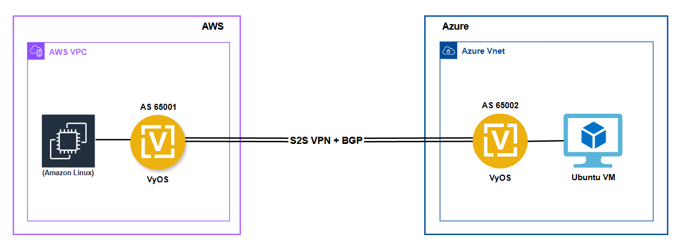

# Terraform Projects for Deploying VyOS on AWS and Azure for Cloud-to-Cloud Connectivity

This project provides Terraform modules and examples to deploy **VyOS routers on AWS and Azure** in order to establish a **secure Cloud-to-Cloud connection** using **IPsec with BGP**.  

---

## Why Cloud-to-Cloud Connectivity?

Cloud-to-cloud connectivity is needed in modern multi-cloud environments for several reasons:

- **Inter-Cloud Connectivity**  
  Enable secure and reliable communication between workloads in different clouds  
  (e.g., AWS applications connecting to Azure-hosted identity services).

- **Cloud-to-Cloud Migration**  
  During migration projects, workloads may temporarily run in both clouds.  
  Direct tunnels ensure smooth cutover and synchronization.

- **Testing and Validation**  
  Labs and POCs often simulate multi-cloud architectures.  
  A VyOS-based tunnel lets teams test routing, encryption, and failover before production rollout.

---
## Architecture

The architecture consists of VyOS routers deployed in both AWS and Azure, connected via secure IPsec tunnels. BGP is used for dynamic routing between the clouds, allowing for seamless communication.

This is the connection diagram:


## Prerequisites

Before applying this module, ensure you have:

### AWS Requirements

- An active AWS account.
- AWS CLI installed. [Installation link](https://docs.aws.amazon.com/cli/latest/userguide/getting-started-install.html)
- Terraform installed. [Installation link](https://developer.hashicorp.com/terraform/tutorials/aws-get-started/install-cli)

### Set AWS environment variables

- Run the following commands in your terminal to set the AWS environment variables:

```sh
export AWS_ACCESS_KEY_ID="<AWS_ACCESS_KEY_ID>"
export AWS_SECRET_ACCESS_KEY="<AWS_SECRET_ACCESS_KEY>"
export AWS_SESSION_TOKEN="<AWS_SESSION_TOKEN>"
export AWS_DEFAULT_REGION="<AWS_REGION>" # e.g us-east-1
```

### Fetch AMI ID and Owner ID (Required for main.tf)
First, you must subscribe to VyOS in the AWS Marketplace.
Then, use the following AWS CLI command to find the correct AMI ID, Owner ID, and ensure you're querying the correct region (e.g., `us-east-1`):

```sh
aws ec2 describe-images \
  --owners aws-marketplace \
  --filters "Name=product-code,Values=8wqdkv3u2b9sa0y73xob2yl90" \
  --query 'Images[*].[ImageId,OwnerId,Name]' \
  --output table
```
Alternatively, you can hardcode the latest AMI ID for your region in `variables.tf` adding the `vyos_ami_id` variable.

### Generate SSH keypair

A demo SSH keypair is included in the `keys/` folder.

To generate a new key (optional):

```sh
ssh-keygen -b 2048 -t rsa -m PEM -f keys/vyos_custom_key.pem
```
 
### Azure Requirements

Before applying this module, ensure you have:

- An active Azure subscription:
                                                                                   
```sh
az account set --subscription "<subscription ID or name>"
```

- Azure CLI installed. [Installation link](https://learn.microsoft.com/en-us/cli/azure/install-azure-cli)

- Logged in with Azure credentials via CLI:

```sh
az version
az login
```

- Azure Resource Group (RG) created:

```sh
az group create --name demoResourceGroup --location westus
az group list
az group show --name exampleGroup
```

- Terraform installed. [Installation link](https://developer.hashicorp.com/terraform/tutorials/aws-get-started/install-cli)


## Usage

### Setup Variables

**AWS**

All variables needed for customization are defined in `variables.tf`. Adjust them according to your requirements, such as EC2 instance type and networking configurations. Before deployment, ensure you check `aws_region`, `availability_zone`, and update `vyos_ami_id` as necessary.

**Azure**

All variables needed for customization are defined in `variables.tf`. Adjust them according to your requirements, such as VM size and networking configurations. Before deployment, ensure you check `azure_region`, `availability_zone`, update `subscription_id` and `resource_group_name` as necessary.

## How to Run the Module

Follow these steps to initialize, plan, apply, and manage your infrastructure with Terraform:

1. **Initialize the Module**
```sh
terraform init
```

2. **Format the Terraform Code**
```sh
terraform fmt
```

3. **Validate Configuration**
```sh
terraform validate
```

4. **Preview Infrastructure Changes Before Deployment**
```sh
terraform plan
```

5. **Apply the Configuration**
```sh
terraform apply
```
Confirm the execution when prompted to provision the infrastructure.

6. **View Outputs**
```sh
terraform output
```
This will display the management IP and test results for the VyOS instance.

## Management

To manage the VyOS instance, use the `vyos_public_ip` from `terraform output`:
```sh
ssh vyos@<vyos_public_ip> -i keys/vyos_custom_key.pem
```
## Post-Deployment Configuration

After deployment, apply the following manual changes to both VyOS routers on AWS and Azure.
    
### VyOS on AWS

```vyos
delete vpn ipsec site-to-site peer AZURE-VyOS remote-address
set vpn ipsec site-to-site peer AZURE-VyOS remote-address '<AZURE-VyOS-Pub-IP>'
set vpn ipsec option disable-route-autoinstall
```

### VyOS on Azure

```vyos
delete vpn ipsec site-to-site peer AWS-VyOS remote-address
set vpn ipsec site-to-site peer AWS-VyOS remote-address '<AWS-VyOS-Pub-IP>'
set vpn ipsec option disable-route-autoinstall
```

## Destroying Resources

To clean up the deployed infrastructure:
```sh
terraform destroy
```
Confirm the execution when prompted to remove all provisioned resources.

